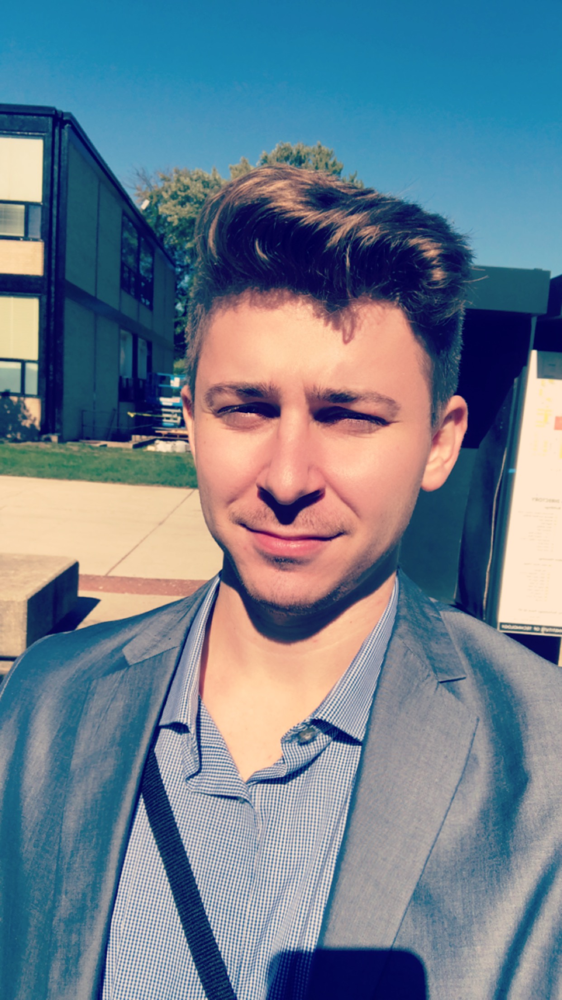
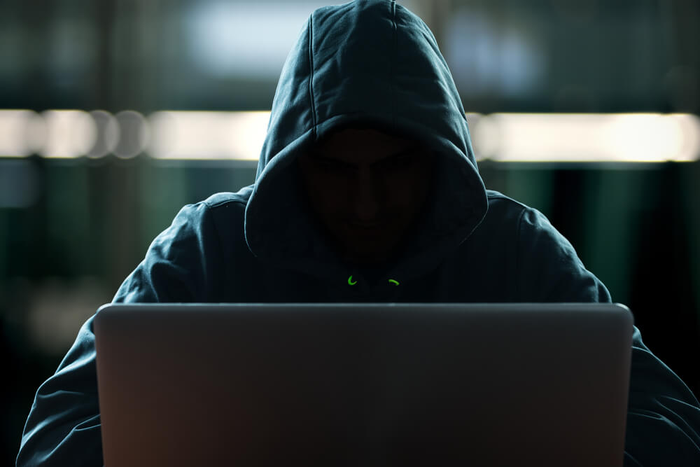

## Andy Dimnych

      
## Where are you from?
I was born in Ukraine, I came to the United States when I was 10 years old.

## IT Interest/ Specialty
I enjoy learning about cryptography, penetration testing encryption. I love difficulty that my specialty Cyber Forensics and Security graduate program has to offer. I wish to work the for the United States Federal government specificall with the Department of Defense. 
#####Some Platforms I am familiar with 

Kali Linux
Ubuntu
Mac OS
Windows 10
 
#####Virtualization
VMware Workstation
VirtualBox
Virtualization
TCP/IP

#####Open Source Tools
NMap
Nessus
Meterpreter

## Something Interesting About You

I can speak 4 languages, Ukrainian, Polish, Russian, English. I love to travel and go to music festivals. 
I have traveled to 9 countries in the past 3 years. 

